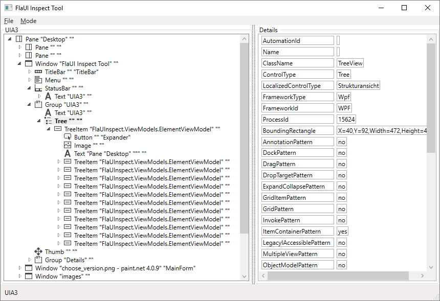
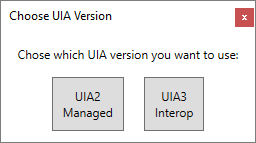
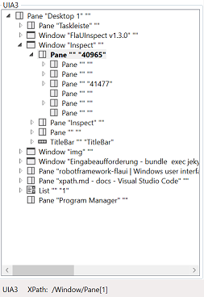
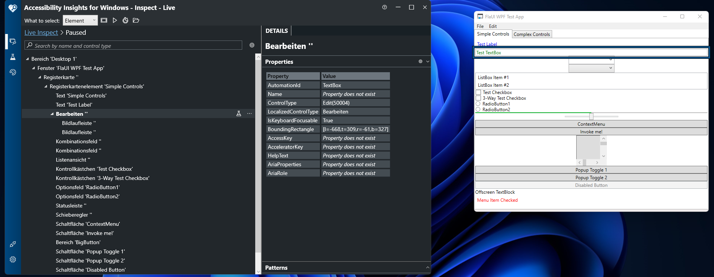

--------

# Inspectors

## FlaUI-Inspector

> Robot-Framework-FlaUi uses XPath based search of user interface elements by default.
> FlaUi has implemented its own [GUI inspector](https://github.com/FlaUI/FlaUInspect) which is used for simplified XPath detection.
> This supports both UIA 2/3 interfaces.

> #### Supported modes are
>  * Hover Mode (ctrl)
>  * Focus Tracking
>  * Show XPath

> The XPath is used in every common test automation environment (GUI testing, web browser testing). 
> It can be used to iterate or search over specific nodes. 
> For example, the Selenium library also uses an XPath that iterates over the DOM and the UIA2/3 interfaces over the Windows GUI.
> Here you can also execute specific XPath searches via the UIA2/3 interface.

## Microsoft Accessiblity Insights for Windows

Microsoft Accessiblity Insights for Windows is a GUI automation tool to find issues in GUI applications. With this tool you can also interpret XPaths.

Each element searched for can be interpreted through the tree. Here you simply pick the corresponding ControlType.

# XPath

## Usage examples

> By general an xpath is fully set by desktop root view to the corresponding ui element which should be interact.  
> Microsoft use the XPath 1.0 or 2.0 specification. 
> They are multiple values which can be used to detect the correct ui-element.  
> All XPaths starts by a slash usage and user interface elements like a Windows, Button, Tab etc.  
> Example sample usage : ***/Window[@Name="FlaUI WPF Test App"]/Tab/TabItem[@Name="Simple Controls"]/Edit[@AutomationId="TextBox"]***

### General usage

------

> #### Automation-ID usage by /UI-ELEMENT[@AutomationId=Value||"StringValue"]
> XPath Example usage: ***/Window/Pane[@AutomationId=40965]***  
> XPath Example usage: ***/Window/Pane[@AutomationId="TextboxId"]***  
> Unique graphical user interface object identifer.

> #### Class-Name usage by /UI-ELEMENT[@ClassName="Value"]
> XPath Example usage: ***/Window/Pane[@ClassName="ReBarWindow32"]***  
> Class name from gui identifier. High possibility to find this element multiple times because it's general used from gui framework implementations.

> #### Name usage by /UI-ELEMENT[@Name="Value"]
> XPath Example usage: ***/Window/Pane[@Name="Inspect"]***   
> Name from a ui-element.  
> Be carefully in general names are internationalized.  
> ***How to test?***  
> Simple change desktop langauge from windows and verify names.

> #### Help-Text usage by /UI-ELEMENT[@HelpText="Value"]
> XPath Example usage: ***/Window/Pane[@Id="HelpTextValue"]***  
> Property help text from ui-element.   

### Specialized usage

------

All examples can be found in /documentation Branch from robotframework-flaui repository under [examples](https://github.com/GDATASoftwareAG/robotframework-flaui/tree/documentation/examples/xpaths).

> #### XPath search pattern by //UI-ELEMENT
> XPath Example usage: ***//Edit[@AutomationId="TextBox"]***

> #### XPath contains pattern by contains(Property,Value)
> XPath Example usage: ***/Window[contains(@Name,"FlaUI WPF")]//Edit[@AutomationId="TextBox"]***

> #### XPath contains pattern by starts-with(Property,Value)
> XPath Example usage: ***/Window[starts-with(@Name,"FlaUI")]//Edit[@AutomationId="TextBox"]***

> #### XPath contains pattern by logic statements (or, and)
> XPath Example usage: ***/Window[contains(@Name,"FlaUI WPF")]/TitleBar/Button[@Name="Schließen" or @Name="Close" or @AutomationId="Close"]***

# Do you know of any other XPath examples? 
* Be welcome to update the documentation page and example project.

[back](./)